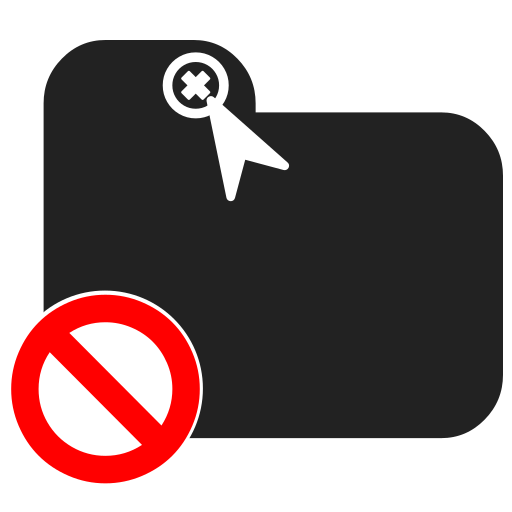

# Don't Leave

Don't Leave is a browser extension prevents your important tabs from closing, reloading, or leaving in order to keep you focused.
It'll alert you with a message if you try to close, reload, or leave the page anyway.

## Why our extension?

- Only by one click.
- Open-Source.

## Chrome Extension

<https://chrome.google.com/webstore/detail/dont-leave/miikombcflpfechloeocnelmgeekgild>

## Contributing

Pull requests are welcome. For major changes, please open an issue first to discuss what you would like to change.

## License

[MIT](https://choosealicense.com/licenses/mit/)
